# Domain Adaption using Synthetic Image translation


### **photo synthesis 팀 구성**


| 이름   |  구성   |                      역할                  |
|:---:|:---:|:-------------------------------------:| 
| 류한웅 |  팀장  | yolov5, cycleGAN, 데이터 정제 및 생성   | 
| 안희상 |  팀원  | Neural Style Transfer, 외부 데이터 수집, PPT 작성  | 
| 허준호 |  팀원  | yolov5, cycleGAN, 데이터 정제 및 생성, 결과 시각화  | 
| 양원규 |  팀원  | Neural Style Transfer, 데이터 분석, 결과 시각화 | 


### **Environments**

- Ubuntu 18.04 LTS
- Docker
- AMD Ryzen5 5600x
- Geforce RTX 3080 12GB / RAM 32GB
- Jupyter notebook


<br>


## 🗒️ Content

--- 

### □ **데이터 정보**

| | #Sequences | #Images | Multiple Cities | Multiple Weathers | Multiple Times of Day | Multiple Scene types |
|:---:|:---:|:----:| :---:|:---:|:---:|:---:|
| Kitti | 22 | 14,999|No|No|No|Yes| 
| vKitti | 5|2,126|No|Yes|No|Yes|
| BDD100K |  100,000|120,000,000|Yes|Yes|Yes|Yes|


### 사용된 원본 데이터셋
- **kitti** : 자율주행을 위한 현실 데이터셋
- **vkitti 2**  : 자율주행을 위한 합성 데이터셋
- **BDD100K** : kitti에는 없는 다양한 환경의 현실 데이터셋

### 학습에 사용된 데이터셋
- **BDD100K** : 환경별로 분류하여 CycleGAN모델 학습에 사용
- [**kitti+vkitti(Baseline)**](preparing_dataset/yolov5/vkitti_kitti_generator.ipynb) : kitti와 vkitti를 각각 사용
- [**kitti+vkitti+CycleGAN**](preparing_dataset/yolov5/cycleGAN_train_dataset_generator.ipynb) : Baseline의 환경적인 부분을 [CycleGAN으로 생성한 데이터](preparing_dataset/cycleGAN/cycleGAN_generator/cycleGAN_generator.ipynb)로 대치
- **kitti+vkitti+NST** : Baseline의 환경적인 부분을 [neural style transfer로 생성한 데이터](preparing_dataset/NeuralStyleTransfer/Neural_Style_Transfer.ipynb)로 대치

### 검증에 사용된 데이터셋
- **BDD100K** : BDD100K의 train 데이터셋을 가려진 객체의 수의 비율로 분류하여 사용


<br>


## 📒 진행 과정

---

## Overview

### □ Purpose
- 실제 환경의 데이터셋을 합성 데이터셋에 반영하여 **domain gap reduce**
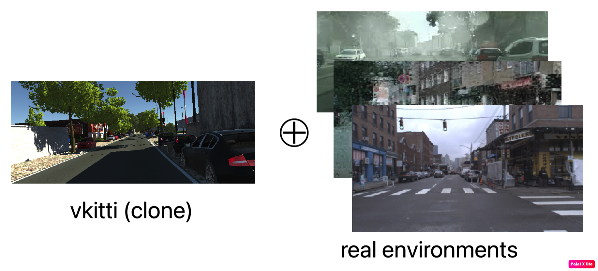

### □ Structure

- 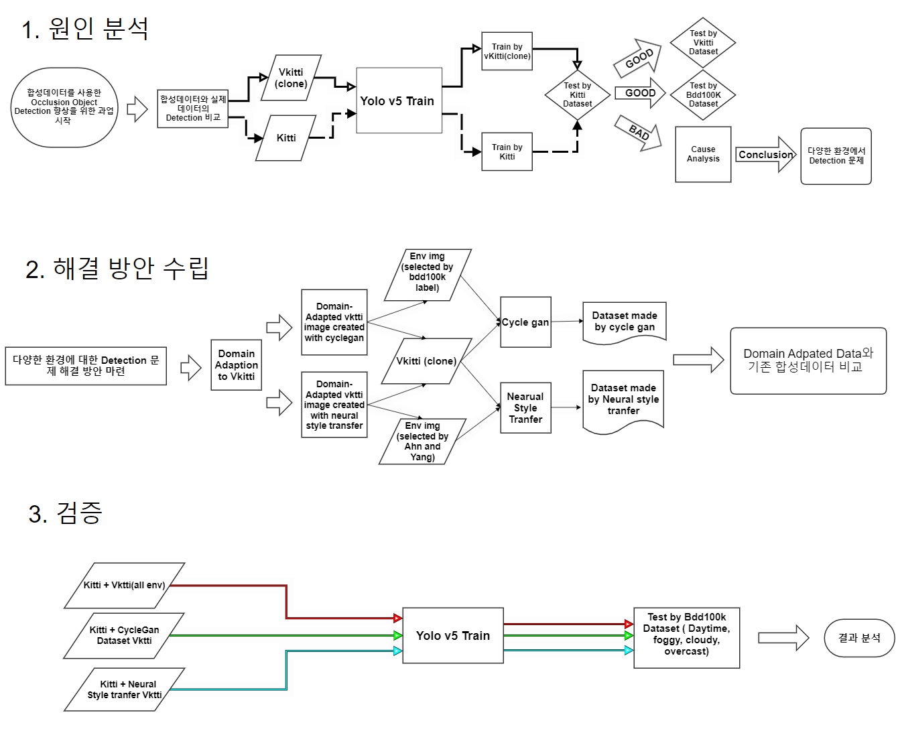
- 사용 모델 : yolov5, cycleGAN, neural style transfer
- 모델 평가 및 지표 : occluded dataset, mAP@0.5


## Process

### □ 기업 과업 소개(문제 인식 및 도출)

- 대낮과 같은 일반적인 환경에서는 detecting 성능이 준수하지만, 자연 환경이 변하면 detecting 성능이 떨어짐
- Photo Sythesis 팀은 다양한 환경에서도 detecting 성능을 높히는 방법 대해 연구하였으며, 제한된 데이터를 image augmentation을 통해 다양한 환경으로 증강 시킨 후 학습하여 성능 개선을 이룸

### □ 원인 분석
```
yolov5 + kitti + vkitti(모든 환경) img
```

yolov5모델에서 [Kitti+vkitti데이터셋](preparing_dataset/yolov5/vkitti_kitti_generator.ipynb)으로 학습시킨 경우 가려진 객체를 어느정도 탐지<br>

<details>
  <summary>
    가려진 객체를 잘 검출하게 되는 요인
  </summary>
  <div markdown="1">

  - ### Bag of freebies
    bag of freebies는 Data augmentation, Loss function, Regularization 등 학습에 관여하는 요소로, training cost를 증가시켜서 정확도를 높이는 방법들을 의미한다.
    
  - ### Bag of Specials
    Bag of Specials는 architecture 관점에서의 기법들이 주를 이루고 post processing도 포함이 되어 있으며, 오로지 inference cost만 증가시켜서 정확도를 높이는 기법들을 의미한다.
    
  - ### Self-Adversarial Training
    input image에 FGSM과 같은 adversarial attack을 가해서 model이 예측하지 못하게 만든다. 그 후 perturbed image와 원래의 bounding box GT를 가지고 학습을 시키는 것을 Self-Adversarial Training이라 한다. 이 방식은 보통 정해진 adversarial attack에 robustness를 높이기 위해 진행하는 defense 방식인데, 이러한 기법을 통해 model이 detail한 부분에 더 집중하는 효과를 보고 있다.
    
  - ### Mosaic Augmentation
    각기 다른 4개의 image와 bounding box를 하나의 512x512 image로 합쳐주며, 당연히 image의 모양 변화에 따라bounding box GT 모양도 바뀌게 된다. 이를 통해 하나의 input으로 4개의 image를 배우는 효과를 얻을 수 있어 Batch Normalization의 statistics 계산에 좋은 영향을 줄 수 있다고 한다. 
    
    Mosaic Augmentation을 이용하면 기존 batch size가 4배로 커지는 것과 비슷한 효과를 볼 수 있어 작은 batch size를 사용해도 학습이 잘된다.
    
    또한, 4개의 image를 하나로 합치는 과정에서 자연스럽게 small object들이 많아지다 보니 small object를 학습에서 많이 배우게 되어 small object에 대한 성능이 높아지는 효과도 
    있는 것 같다.
  </div>
</details>
<br>

```
밝은날(탐지 잘됨) / fog,rain,overcast(탐지 안됨) img
```
하지만 학습 데이터셋에 없는 다른 환경에 대해서는 성능이 저조함을 발견하고,
다양한 환경에 대한 학습을 위해 데이터 증강 기법을 적용할 필요성을 느낌
<br>

### □ 해결을 위한 방향성
- ### Domain Apdaptaion 
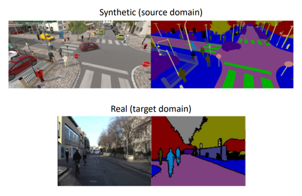
>source domain과 target domain의 domain shift를 transfer learning을 통해 줄인다.
Transfer learning이라 하면 GAN과 같은 모델로 source image와 target image 사이의 간극을 줄일 수 있다.
합성데이터를 이용해 real data를 대비하여 학습시킨다 

- ### DR
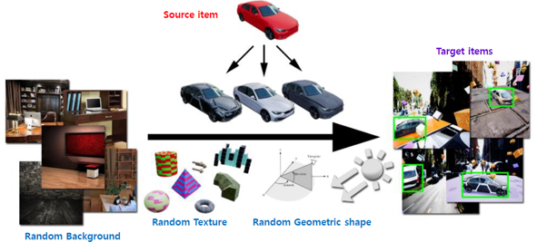
>질이 떨어지는 데이터로도 최선의 성능을 끌어내자 
질 좋은 데이터를 학습시키더라도 세상에 있는 많은 변수들에 대해 일반화하는 것은 불가능하기에 각종 데이터에 변수들을 넣어줘 어떤 변수에 있어서라도 대응을 하는 데이터셋을 만들자


- #### 앤드류응 Data Centric
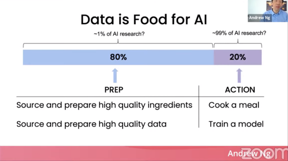

>아무 이미지나 학습하는 것보다 하이퀄리티 이미지 학습시키는 것이 좋다.
값비싼 좋은 재료로 요리하는 것과 같다. 라벨링의 일관성이 핵심이다 .합성 데이터 프로그램에 투자할 필요가 있다. 더 좋은 데이터를 통해 모델의 성능을 높인다.

----------------------------------------------

### Neural style transfer
>DR기법과 DA기법의 접근을 같이 가져간것으로 원본의 퀄리티가 떨어지지만 cotnets에 대한 가중치와 style에 대한 가중치의 조절 그리고 여러 style을 접목 시킬 수 있음으로 다양한 데이터를 만들 수 있다. 

### Cycle gan
>DC와 DA의 접근을 가져간 것으로 cycle gan의 모델의 generator 모델은 resnet 사용하기 때문에 이미지의 품질이 보장되었고 결국 환경을 바꾸면서도 품질이 높은 이미지를 만들 수 있었다.

### 예측 결과
>기존 vkitti의 다양한 환경에서의 데이터셋이 현실 세계에서의 특징을 제대로 반영하지 못하여 학습 성능이 떨어진다고 판단하여, cycleGAN과 neural style transfer와 같은 모델을 사용하여 현실 세계의 특성을 합성 데이터셋에 적용시킬 수 있다면 보다 더 나은 학습 결과를 기대할 수 있을 것


<br>

### □ data augmentation
 - Cycle GAN과 Neural Style Transfer 모델을 사용하여 data augmentation에 필요한 이미지들을 생성하였습니다.<br>
 
 　　　[**Cycle Gan**](preparing_dataset/cycleGAN/cycleGAN_generator/cycleGAN_result_out.ipynb)<div>
  <div markdown="1">

  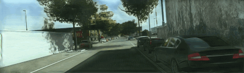<br>
  　　　　　　　　　　　　　　original  　　　　　　　　　　　　　　　　　　　　 overcast<br><br>
  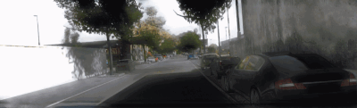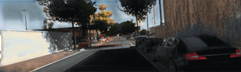<br>
  　　　　　　　　　　　　　　　fog 　　　　　　　　　　　　　　　　　　　　　　　rain
  </div>

<details>
  <summary>about CycleGan</summary>
  <div markdown="1">

<details>
<summary>CycleGan Abstract</summary>

  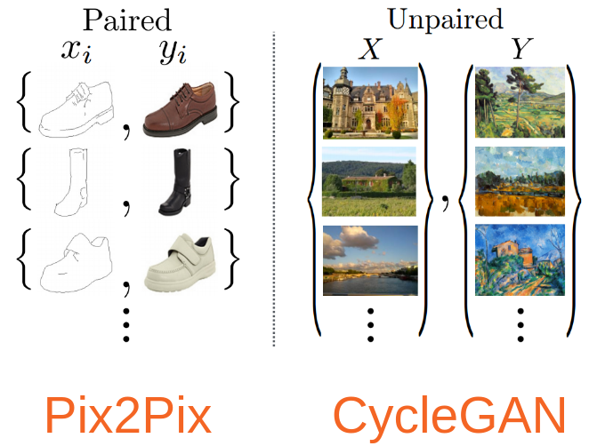

  Image-to-Image translation은  train 세트를 이용해 인풋 이미지와 아웃풋 이미지를 매핑하여 그럴듯한 이미지를 만드는 것이 목표이다.  cycle gan 이전에는 많은 태스크에 있어서 **짝이 지어진 학습 데이터**를 사용하여 Image to Image translation은 가능하였지만 짝지어지지 않은 image는 tralation하기 힘들었다. 이 부분을 해결해 주기 위해  **짝지어진 예시 없이 X라는 도메인으로부터 얻은 이미지를 타깃 도메인 Y로 바꾸는 방법**을 제안하는 모델입니다.

<div markdown="1">
</div>
</details>

<details>
<summary>모델 선정 이유</summary>

  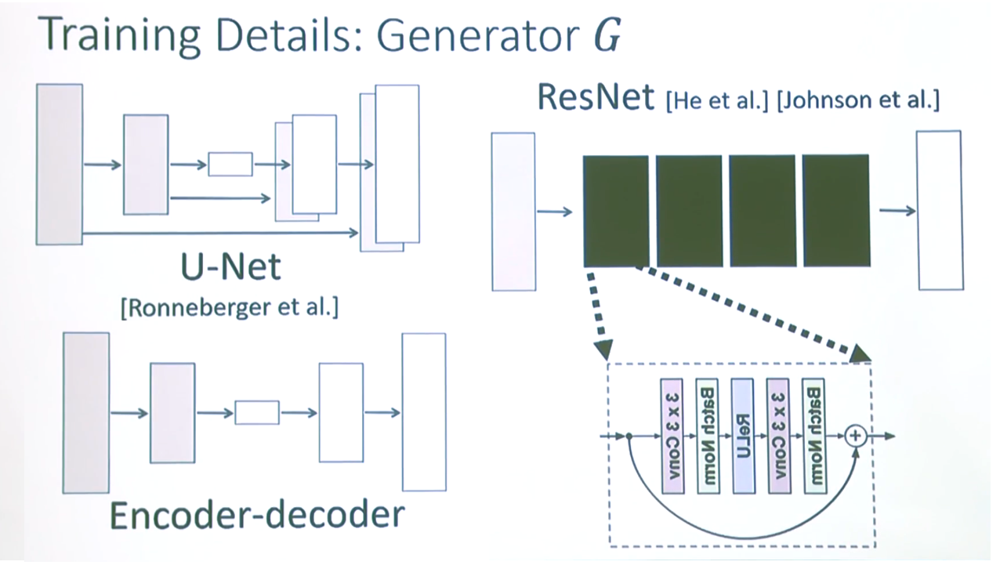

  - vkitti와 다른 현실적인 환경의 dataset에 짝이 없기 때문.

  - Cycle gan의 ganerator model이 Encoder Decorder이 아닌 Resnet을 이용합니다. Resnet Redisual block의 skip connection은 depth별 이미지 층에 대한 정보가 남아있기 때문에  전체적인 source의 원본을 유지를 한다고 말합니다.

  >저희는 Vkitti 원본을 보존하고 bdd100k의 다른 domain 환경으로 변경하는데 효과적일 것같다고 생각되어 cycle gan을 선정하였습니다.

  - 그림의 u-net 또한 skip connection을 가지고 있지만  Encoder-Decoder를 기반으로 한 UNet 은 극단적인 bottleneck 구조입니다.
  이러한 구조의 장점은 모양의 변화가 가능하지만, 모델의 학습 자체가 굉장히 불안정하다고 합니다.  
  또한 입력과 목표 데이터가 비슷할 경우 Skip Connection의 사용이 늘어나 모델의 depth 적인 측면으로 학습이 전혀 되지 않는다고 말합니다.
  특징으로는 UNet을 이용해 학습을 할 시 결과 이미지에서의 모양에 대한 변화가 크다고 합니다.


<div markdown="1">
</div>
</details>

<details>
<summary>CycleGan 핵심 아이디어</summary>

  ## gan의 moving target에 제약 조건을 건다.
  gan은 target이 명확하지 않다. Descripter와 Generator가 서로의 loss를 줄여나가는 과정에 있어서 그럴듯한 target을 뽑는 것이 목표이다.  그렇기 때문에 생기는 문제가 mode collpase이다. 

  mode collapse를 쉽게 이야기하자면 input을 어떤것을 넣어도 정답과 유사하다고 판단하는 같은 output을 내는 문제이다. 
  이 문제를 해결하기 위한 cycle consisitency loss의 컨셉은 이 이미지가 x->y로 맵핑 될때 y->x로 다시 돌아갈 수준으로 이미지를 translation 하는 것이다. 

  
  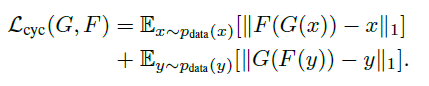

  정확하게는 G(x)로부터의 이미지 데이터의 분포와 Y로부터의 이미지 데이터의 분포가 구분 불가능하도록 G:X→Y G:X→Y G : X → Y 를 학습시키는 것이다. 이러한 매핑(함수)은 제약이 적기 때문에, 우리는  F:Y→XF:Y→X F : Y → X  와 같은 역방향 매핑을 진행, F(G(x))F(G(x)) F(G(x)) 가 X와 유사해지도록 강제하는 cycle consistency loss를 도입하여 mode collapse를 해결


</div>
</div>


<br>


　　　**Neural Style Transfer**

<br>
　　　　　　　　　　　　original 　　　　　　　　　　　　　　　　　　　　　　rain<br>


  
<details>
<summary>about Neural Style Transfer</summary>
<div markdown="1">

  - Neural Style Transfer
  
  Neural Style Transfer는 타겟 이미지의 콘텐츠는 보존하면서, 참조 이미지의 스타일을 타깃 이미지에 적용하는 방식이다.
  
  input image가 contents image로 보일 뿐만 아니라, style image의 style이 그려지도록 각각을 혼합하는데 사용되는 최적화 기술이다.
  
  아래 예시 이미지를 가져와봤다.
  
  
  
  Neural Style Transfer의 원리는 2가지 다른 함수를 정의하는 것으로 하나는 어떻게 두 이미지의 콘텐츠가 차이나는지 설명하고(Lcontent), 다른 하나는 두 이미지의 스타일의 차이(Lstyle)를 설명한다.
  
 즉, 기본 input image, 일치시키고 싶은 contents image와 style image를 선택한 후 contents와 style 간의 차이를 역전파(backpropagation)로 최소화함으로써 기본 input image를 
 변환한다.
  
  
  
  위의 이미지에서 보이는 바와 같이 content image와 style image가 존재하고, 우리가 생성할 이미지 x는 white noise부터 시작해서 content의 정보와 style의 정보를 합성해서 얻는다.  (*white noise란 noise를 주파수 도메인으로 변환시켰을 때 스펙트럼이 전부 상수인 경우)
  
  모두 동일하게 pretrained VGG network를 활용하며 이때의 학습은 VGG network가 아니라 input image x가 backdrop되면서 점차 변화하는 것을 의미한다.
 
 - 각 image들의 iteration, 크기, 가중치들을 설정해준다.
  
  

 - Content와 Style 표현
  image의 content와 style을 표현을 얻기 위해, model안에 중간 layer들이 있다.
  
  이 중간 layer들은 feature map을 나타내는데 이는 깊어질수록 높이가 커지게 된다. 우리는 미리 학습된 이미지 분류 신경망인 VGG16 신경망을 사용한다.
  
  이 신경망의 중간 layer들은 이미지의 style과 content의 표현을 정의하는데 필요하다.(중간 layer들에서 input image의 해당 style 및 content가 목적에 맞춰지도록 시도)
  
  -중간 layer
  학습된 이미지의 분류 신경망의 중간 layer 출력값들이 style과 content를 어떻게 정의할까?
  
  높은 layer 단계에서, 이 현상은 신경망이 (신경망이 학습해 온)image 분류를 하기 위해서는 반드시 image를 이해해야 한다. 원본 image를 입력 pixel로 사용하고 원본 image pixel을 image 내 feature들의 복잡한 이해형태로 변형하는 방식으로 내부 표현을 설계한다.
  
  이는 CNN이 얼마나 잘 일반화 될 수 있는지에 대한 이유이기도 하다. CNN은 배경이나 다른 노이즈들에 영향을 받지 않는 class 내에 존재하는 불변성(invariances)을 포착하고, feature들을 정의할 수 있다.
  
  그러므로 원본 image가 입력되고 분류 label이 출력되는 구간 어딘가에서 model은 복잡한 feature 추출기로 작동한다. 따라서 중간 layer에 접근함으로써 input image의 content와 style을 설명할 수 있다.
  
  

  - model
  
  우리가 사용한 모델 vgg16은 ResNet,Inception과 비교해 상대적으로 간단한 모델인 덕분에 Style Transfer를 하기에 더 효과적이다.
  
  style과 content의 feature에 해당하는 중간 layer 접근을 위해, 케라스를 사용해 원하는 출력을 activation으로 model을 정의함으로써 해당 출력값을 얻을 수 있다.
  
  

  - content loss
  
  content loss 함수는 실제로는 간단한데, 적용하고픈 content image와 기본 input image를 신경망으로 통과시킬 수 있다.
  이는 설계 model에서 중간 layer의 출력을 반환한다. 그런 다음 그저 이미지들 간의 중간 표현들 사이에 유클리드 거리(Euclidean distance)를 취한다.
  (여기서 유클리드 거리는 다차원 상의 두 점 사이의 거리를 계산하는 공식이다.)
  
  이러한 content 손실을 최소화 하기 위해 일반 방식으로 역전파(backpropagation)을 수행한다. 따라서 특정 layer(content_layer에 정의된)에서 원본 content image로 유사한
  반응을 생성할 때까지 초기 image를 변환시킨다.
  
  
  
  -Style loss
  Style loss를 계산하는 것은 content loss에 비해 좀 더 어렵지만, 동일한 원칙을 따른다. 이번에는 신경망에 기본 input image와 style image를 입력으로 사용한다.
  
  기본 input image를 위한 style을 생성하려면, content image에서 기울기 하강(Gradient Descent)을 수행하여 원래 image의 style표현과 일치하는 image로 변환한다.
  
  style image의 feature 상관관계(correlation) map과 input image사이의 평균 제곱 거리(MSE)를 최소화함으로써 이 작업을 수행한다.
  
 

  -경사하강법
  손실을 최소화하도록 반복적으로 출력 이미지를 업데이트할 것이다. 신경망과 관련된 가중치를 업데이트를 하지 않고, 대신 손실을 최소화하기 위해 input image를 훈련시킨다.
  이를 위해서는 loss와 기울기를 어떻게 계산하는지 알아야 한다. content 및 style image를 load하는 기능을 할 작은 함수를 정의하여 신경망에 image들을 input으로 주고, 모델에서 content 및 style feature 표현을 출력한다.
  

  이러한 일련의 과정들을 거쳐 image를 생성한다.


  
</div>
</details> 


<br>


### □ 검증

### validation dataset
 - BDD100K의 train데이터셋 전부를 val dataset으로 사용하였습니다.
 - 가려진 객체(car,van,truck)의 개수가 '0-5', '0-10', '0-전체'인 데이터셋으로 분리하여 검증했습니다.
 - '0-5', '0-10', '0-전체'는 가려진 객체의 비율(약 1:1:1)로 나누어 결정하였습니다.

  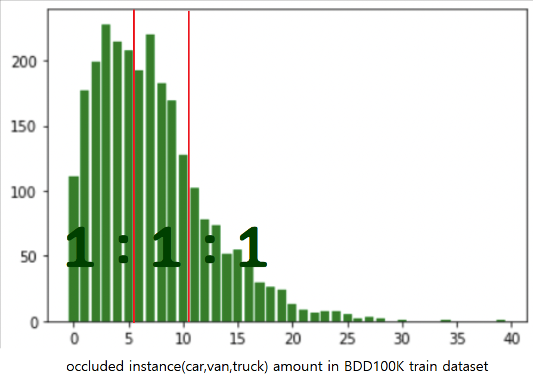

[**val_result folder**](https://github.com/Phot0Synthesis/sim2real/tree/main/val_result)

### kitti + vkitti + cycleGAN mAP@0.5 result
|occlusion amount|baseline|ours(cycleGAN)|
|:--:|:--:|:--:|
|0~5|0.379|**0.413**|
|0~10|0.358|**0.387**|
|0~all|0.342|**0.365**|


### kitti + vkitti + Neural Style Transfer mAP@0.5 result
|occlusion amount|baseline|ours(NST)|
|:--:|:--:|:--:|
|0~5|0.379|0.376|
|0~10|0.358|0.355|
|0~all|0.342|0.336|

> 합성데이터에 환경정보를 추가한 데이터셋의 가려진 객체 탐지에 있어서 성능 향상이 있음을 확인할 수 있습니다.

<br><br>

## reference 

[1] [Structured Domain Randomization: Bridging the Reality Gap by
Context-Aware Synthetic Data](https://arxiv.org/pdf/1810.10093.pdf)

[2] [Photorealistic Style Transfer via Wavelet Transforms](https://openaccess.thecvf.com/content_ICCV_2019/papers/Yoo_Photorealistic_Style_Transfer_via_Wavelet_Transforms_ICCV_2019_paper.pdf) 

[3] [Unpaired Image-to-Image Translation using Cycle-Consistent Adversarial Networks](https://arxiv.org/pdf/1703.10593.pdf)

[4] [KITTI : Object Scene Flow for Autonomous Vehicles](http://www.cvlibs.net/publications/Menze2015CVPR.pdf)

[5] [Virtual KITTI 2(Cabon, Yohann and Murray, Naila and Humenberger, Martin)](https://arxiv.org/pdf/2001.10773v1.pdf)

[6] [BDD100K : A Diverse Driving Dataset for Heterogeneous Multitask Learning](https://arxiv.org/pdf/1805.04687.pdf)


[7] https://github.com/sukkritsharmaofficial/NEURALFUSE

[8] https://github.com/junyanz/pytorch-CycleGAN-and-pix2pix

[9] https://github.com/ultralytics/yolov5


<br>

### timestamp
<details>
<summary>5월 13일</summary>

<div markdown="1">
yolov5을 vkitti 2.0.3의 일부분의 데이터를 가지고 시험적으로 학습시켜보았습니다.

<details>
<summary>yolov5m모델을 백본 네트워크로 사용</summary>
<div markdown="1">

  [yolov5/yolov5m.yaml at master · ultralytics/yolov5](https://github.com/ultralytics/yolov5/blob/master/models/yolov5m.yaml)
  
  train.py  --img 1248 --batch 8 --epochs 300 --data '../datasets/vkitti2.0.3.yaml' --cfg 'models/yolov5m.yaml' --weights yolov5n.pt --name only_clone
  
  - input img size 640(default)에서 1248로 변경
  </div>
</details> 
<details>
<summary>batch size는 8로  300 epoch 학습</summary>
<div markdown="1"> 
아래는 train_batch 예시

  
  </div>
</details> 
  <details>
<summary>학습 결과</summary>
<div markdown="1"> 
 
  
  </div>
</details> 
  <details>
<summary>detection 결과</summary>
<div markdown="1"> 
  
  
  </div>
</details> 
  
  <details>
<summary>이슈</summary>
<div markdown="1"> 
  - vkitti 2.0.3 dataset에서 같은 바운딩 박스 내에 다른 클래스 객체가 들어있는 경우
    
  - 확인된 경우는 가로5 세로4 바운딩 박스이다.
   
  - 우리는 바운딩 박스로만 학습을 하여 레이블이 중복되는 현상이 있어 중복되는 경우를 삭제하고 학습을 시키는 쪽으로 진행

  - 학습할때 5일정도의 시간이 걸린다.

  - yolov5의 agumentation의 종류를 알고 아이디어를 정해야할듯

  - 학습할때얼마만큼의크기를제한할것인가
    </div>
</details> 
 
  </div>
</details> 
  
 <details>
<summary>5월 16일</summary>
<div markdown="1">
  전체 데이터셋으로 학습 시 시간이 너무 오래 걸려 kitti를 clone한 데이터셋만 학습
  
 <details>
<summary>yolov5n모델을 백본 네트워크로 사용</summary>
<div markdown="1">

  [yolov5/yolov5n.yaml at master · ultralytics/yolov5](https://github.com/ultralytics/yolov5/blob/master/models/yolov5n.yaml)

python train.py  --img 1248 --batch 32 --epochs 300 --data '../datasets/vkitti2.0.3.yaml' --cfg 'models/yolov5n.yaml' --weights yolov5n.pt --name only_clone

- input img size 640(default)에서 1248로 변경
  </div>
</details> 
  
 <details>
<summary>batch size는 32로  300 epoch 학습</summary>
<div markdown="1">  
  
  아래는 train_batch 예시
  
  </div>
</details> 
  
 <details>
<summary>학습 결과</summary>
<div markdown="1">  
  
  
  </div>
</details>  
  
 <details>
<summary>detection 결과</summary>
<div markdown="1">  

  [test_result - Google Drive](https://drive.google.com/drive/folders/1sZngP_ysdRXxTWBZm32POl61barXxK8h?usp=sharing)
  </div>
</details> 
  
 <details>
<summary>이슈</summary>
<div markdown="1">
  - detection 시 confficence score가 상대적으로 낮아 yolov5l6 모델을 사용할 예정
   </div>
</details> 
  </div>
</details>
  
 <details>
<summary>5월 17일</summary>
<div markdown="1">

  
  
  - yolov5l6 모델 사용 : yolov5x6모델은 하드웨어 메모리 부족으로 학습 불가
  
 <details>
<summary>yolov5l6모델을 백본 네트워크로 사용</summary>
<div markdown="1">

  [yolov5/yolov5l6.yaml at master · ultralytics/yolov5](https://github.com/ultralytics/yolov5/blob/master/models/hub/yolov5l6.yaml)

python train.py  --img 1280 --batch 8 --epochs 300 --data '../datasets/vkitti2.0.3.yaml' --cfg 'models/yolov5l6.yaml' --weights yolov5l6.pt --name only_clone_l6

- input img size 1280(default)로 사용
  
  </div>
</details>
  
 <details>
<summary>batch size는 8로  300 epoch 학습</summary>
<div markdown="1"> 
  -아래는 train_batch 예시

  
  </div>
</details>
 <details>
<summary>학습 결과</summary>
<div markdown="1"> 

  
  </div>
</details>
 <details>
<summary>detection 결과</summary>
<div markdown="1">

  [test_result_l6 - Google Drive](https://drive.google.com/drive/folders/1B98K2GRVtaei3moXf61urC8gPZn5YEz5)
  </div>
</details>
  </div>
</details>


